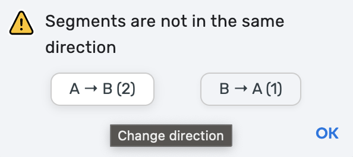
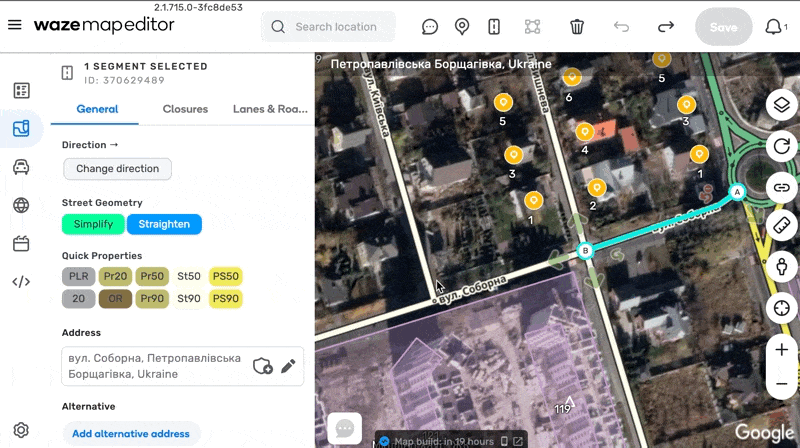
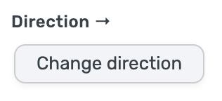

# WME E87
Solves the inconsistent direction problem

> ⚠️ Using this script is likely to delete any stored traffic data from the junction nodes.

Or just reverse the segment direction

## Links
Author homepage: http://anton.shevchuk.name/  
Script homepage: https://github.com/AntonShevchuk/wme-e87/  
GreasyFork: https://greasyfork.org/uk/scripts/456886-wme-e87-inconsistent-direction  
